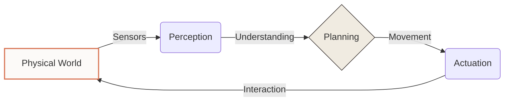

# 1.1 What is Physical AI?

*Physical AI is the definitive bridge between digital intelligence and the material world — the precise moment where software transcends the screen to manipulate reality.*

Unlike traditional AI, which thrives in the frictionless vacuum of data, Physical AI must navigate the unyielding constants of physics. Gravity, inertia, and friction are not just variables; they are the defining boundaries of its existence.

---

## 1. Beyond the Screen: The Necessity of Embodiment

Digital intelligence can recommend the most efficient way to grasp a delicate object. It can simulate a perfect trajectory with mathematical certainty across a million iterations.

> **"Reasoning is the architect; embodiment is the builder. One designs the house, the other feels the weight of the stone."**

But digital intelligence cannot physically pick it up. That requires a body. Physical AI is the sophisticated integration of reasoning and embodiment — the mechanical conversion of abstract thought into tangible action.

:::tip The Aira Standard: Embodiment
The defining trait of Physical AI is **embodiment**. Intelligence is no longer a localized processing event; it is a distributed interactive experience with the environment.
:::

---

## 2. In Conversation with Reality: The Feedback Loop

A Physical AI system operates as a continuous, high-frequency conversation with its surroundings. This is the **Perception-Actuation Loop**, a recursive protocol that defines the machine's situational awareness.

*It isn't a linear command followed by an outcome; it is an ongoing cycle of sensing, deciding, and moving in real-time.*

This cycle often repeats hundreds of times every second. At this scale, precision is no longer a luxury — it is a baseline requirement for stability.

---

## 3. The Trifecta of Intelligent Motion

Physical intelligence rests on three distinct pillars. For a machine to behave with the fluidity of a biological organism, these pillars must be perfectly synchronized.

| Pillar         | Function                                          | The Human Analogy          |
| -------------- | ------------------------------------------------- | -------------------------- |
| **Perception** | Converting raw chaotic data into a structured world model | Seeing and Touching        |
| **Planning**   | Determining the optimal trajectory across the model | Deciding to Move           |
| **Control**    | Executing the physical force with millisecond precision | Contracting the Muscle     |

---

## 4. The Engineering of Unpredictability

Building for the real world is an exercise in managing entropy. In a controlled simulation, conditions are pristine, and the math is absolute.

*In the wild, the floor is slippery, sensors accumulate dust, and mechanical wear introduces non-linear lag.*

A Physical AI must adapt to these unpredictable variables in real-time. It requires **Recursive Resilience** — the ability to recover from a state of imbalance before the laws of physics execute their penalty.

### The Tyranny of the Real-Time Constraint

Software can afford a few milliseconds of latency. A 180kg humanoid cannot. If a bipedal system loses its equilibrium, it has a window of roughly 20-40 milliseconds to execute a recovery maneuver. Delay, in this context, is the difference between a graceful step and a catastrophic failure.

:::warning Engineering Protocol
Redundant safety layers are mandatory. Software limits should always be secondary to physical hardware interlocks and emergency stops.
:::

---

## 5. Summary: From Thought to Action

Physical AI represents the next major evolutionary leap in technology. It marks the transition from computers that help us think to machines that help us act. 

The division between the brain and the body is dissolving. We are now building unified, coordinated systems designed to solve complex human problems within the physical world.

---

## Research & Nodes

- **Node 1.2**: [The Sensory Suite](/docs/module-01-foundations/sensors-state-estimation) — How machines perceive the invisible.
- **Node 2.1**: [Kinematics & Dynamics](/docs/module-02-hardware/kinematics-dynamics) — The mathematics of moving matter.

*Drafted for the Aira Curriculum — Systemic Excellence. 2026.*
